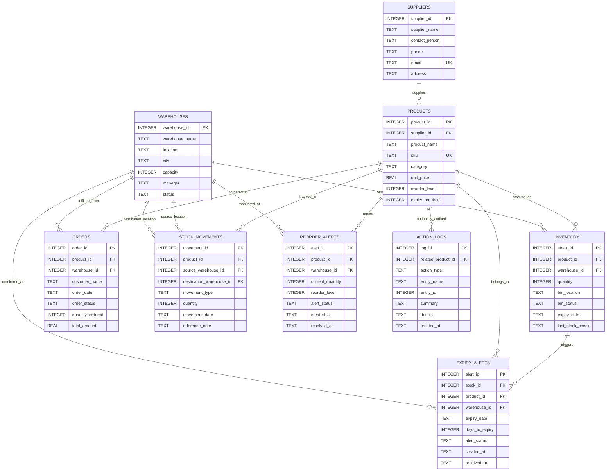

# Smart Warehouse Logistics - ER Diagram

This ER diagram is generated from the project schema in `schema.sql`.

## Relationship Summary

- One supplier supplies many products.
- One product can appear in many inventory rows, orders, stock movements, reorder alerts, expiry alerts, and audit logs.
- One warehouse can store many inventory rows, fulfil many orders, appear in stock movements, and generate alerts.
- One inventory row can generate many expiry alert records over time.
- Action logs optionally reference products through `related_product_id`; some actions, such as demo reset, are system-level actions and keep this field empty.
